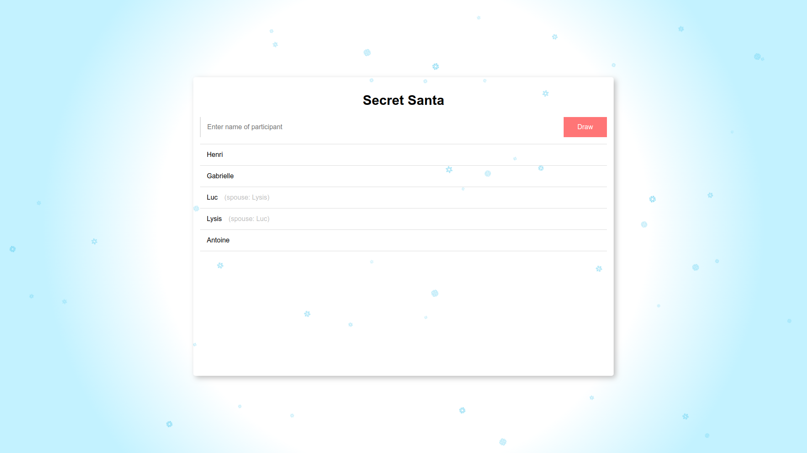

# Secret Santa 🎅

A simple web app to organise a warm secret santa in large families.

## How to use

Enter the name of the participants in the input field.

Set spouses by clicking on 2 partipants.

When ready, click on the `Draw` button to do a draw.

You can then select a participant in the dropdown and click the `See Your Draw` button to see the person you have drawn.

Click the `Hide Your Draw` button to go back to the dropdown.

## Run the project

1. Clone the project `git clone git@github.com:Baboo7/secret-santa.git`
1. Check that you have the right versions of `node` and `npm` (see the `engines` section on the `package.json` file)
1. Install dependencies `npm i`
1. Run the development server `npm run dev`

The website is accessible at `http://localhost:8080`.

## Build

1. Build the project `npm run build`

Open the `index.html` file in the `dist` folder in your browser.

## Test

`Jest` is used to test the code of the application.

1. Run the tests `npm t`

Test can be found in the `test` folder. It mimics the structure of the `src` folder.
